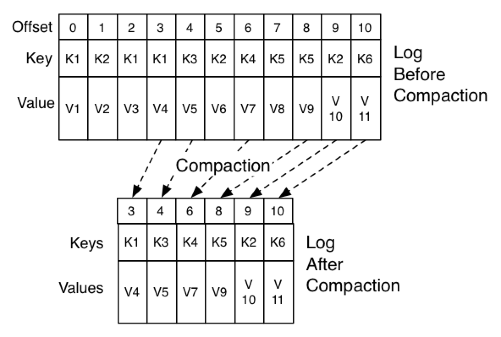

# kafka的数据过期清理策略和配置

Kafka中对过期数据的清理策略有两种，分别是`delete`或者`compact`，通过对topic的`cleanup.policy`, 或者broker的`log.cleanup.policy`来进行设置，比如从topic端来设置，如下：

```shell
> bin/kafka-topics.sh --bootstrap-server localhost:9092 \
                      --create \
                      --topic my-topic \
                      --partitions 1 \
                      --replication-factor 1 \
                      --config cleanup.policy=delete
```

或者在服务端的`server.properties`中进行如下设置：

```properties
log.cleanup.policy=compact
# 这里需要注意的是：如果从broker服务端来设置这个配置的话，那么影响的将是所有的topic
```

### cleaner

kafka服务端内（Broker）有一个cleaner线程池（一个或多个线程），会不断的对topics进行相应的数据的clean策略的执行。cleaner有如下配置可以对其进行控制：

```properties
#这个选项默认是开启的(true)，如果关闭那么对于cleanup.policy=compact的topic将无法进行日志过期清理和合并，会导致数据不断的增长，知道达到服务器存储上限
log.cleaner.enable=true  

# broker中的cleaner线程数，默认是1
log.cleaner.threads=1

# 以下这些选项及其默认值除非必要一般无需修改
log.cleaner.backoff.ms=15000
log.cleaner.dedupe.buffer.size=134217728
log.cleaner.delete.retention.ms=86400000 （1天）
log.cleaner.io.buffer.load.factor=0.9
log.cleaner.io.buffer.size=524288
log.cleaner.io.max.bytes.per.second=1.7976931348623157E308
log.cleaner.max.compaction.lag.ms=9223372036854775807
log.cleaner.min.cleanable.ratio=0.5
log.cleaner.min.compaction.lag.ms=0
```


`delete`和`compact`这两种cleanup数据的策略是有一些区别的。


### delete策略

如果是delete策略，那么kafka直接根据一些`配置选项`将过期的数据进行删除。通常的的选项如下：

```properties
# 超过多长时间对过期数据进行删除，默认7天
retention.ms=604800000

#超过多大数据量kafka会对一个partition的数据进行数据删除，默认是-1，表示没有上限。需要注意的是这个选项是针对的一个partition，所以如果需要控制一个topic的数据量上限的话，需要用这个选项的值乘以partition数。
retention.bytes=-1 
```


### compact策略

如果topic的cleanup策略是compact策略，那么kafka对该topic的cleanup策略就不是直接对过期数据进行直接删除，而是会进行日志文件的compaction。这里的compaction，其核心概念其实是对K-V的数据的多个版本的更新信息进行清理，而只保存Key的最后一个版本的值。这种情况下可以将kafka topic中的数据视为是对数据本身的changelog。

打个比方，比如一个topic中存储的是用户的email地址，key是用户的ID，value是用户的email地址，那么，当某个用户对其email地址进行更新的时候，每次更新就会产生一条新的kafka数据，这条数据实际上是一条changelog，记录了当时时间点这用户的email信息的最新值，但当后续该用户继续对其email进行修改的话，又会产生一条新的changelog，记录其最新数据。所以当kafka对该topic进行cleanup的时候，其cleanup的方式是：对每个key只保留其最新数据，而清理掉那些历史版本。这样topic log中就只记录了某个时间点数据的最新状态，而清理掉其演变成这个状态的整个过程（如下图所示）。这样当应用程序因为某些原因需要重新拉数据，或者bootstrap的时候，就可以从这个状态进行恢复，而不用从头开始还原整个过程，会快很多。



